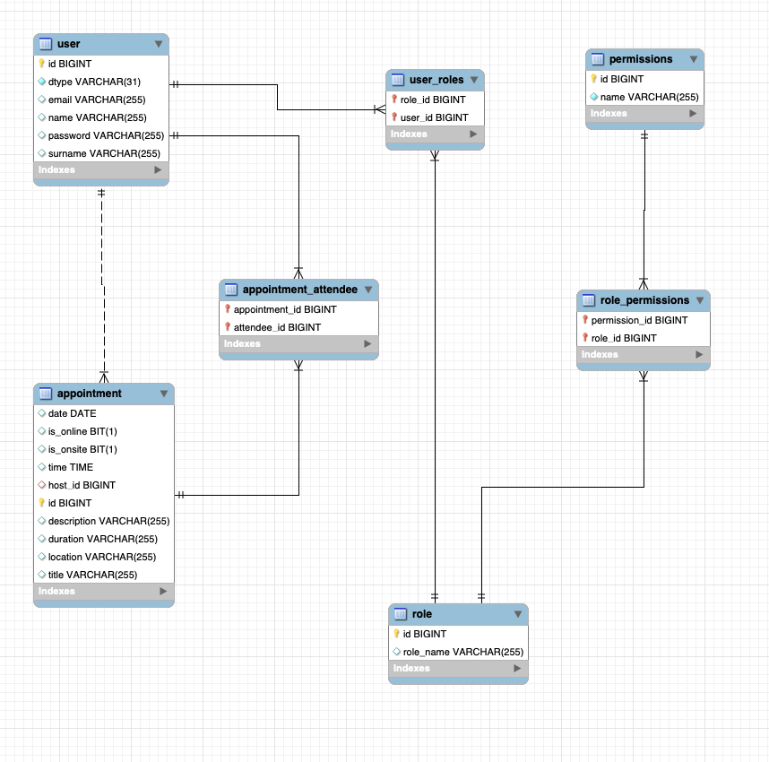

# SMM-Management

Este proyecto esta pensado para gestionar y programar meet en un espacio de uso interno dentro de una empresa.

El SysAdmin es el encargado de la creación de los usuarios

La contraseña de los usuarios esta generada automaticament y es enviada al usuario por email, utilizando Courier un servicio que nos permite enviar correos y crear plantillas.


## Class Diagram 




## Tech Stack

**Server:** Java, Spring, SpringBoot, Courier, Jacoco, Junit.


## Controllers and Routes Structure

Actualmente esta api tiene 3 controllers y diversas rutas

## AuthController

#### Login User

```http
  POST /api/auth/login
```

| Parameter | Type     | Description                |
| :-------- | :------- | :------------------------- |
| `email` | `string` |  email user
| `password` | `string` | password user

#### Register User

```http
  POST /api/auth/register
```

| Parameter | Type     | Description                       |
| :-------- | :------- | :-------------------------------- |
| `name`      | `string` | user name |
| `surname`      | `string` | user surname |
| `email`      | `string` | user email |
| `roles`      | `Array` | Array de objetos      |
|            |         | **Objeto de rol:**    |
|            |         | - `name` (String): Nombre del rol (USER) |
|            |         |**Required**. JWT Token

#### Promote User

```http
  POST /api/auth/promote
```

| Parameter | Type     | Description                       |
| :-------- | :------- | :-------------------------------- |
| `name`      | `string` | user name |
| `surname`      | `string` | user surname |
| `email`      | `string` | user email |
| `roles`      | `Array` | Array de objetos      |
|            |         | **Objeto de rol:**    |
|            |         | - `name` (String): Nombre del rol (ADMIN) |
|            |         |**Required**. JWT Token |


## UserController

#### Create New User
```http
  POST /api/users/post_newUser
```

 Parameter | Type     | Description                       |
| :-------- | :------- | :-------------------------------- |
| `name`      | `string` | user name |
| `surname`      | `string` | user surname |
| `email`      | `string` | user email |
| `roles`      | `Array` | Array de objetos      |
|            |         | **Objeto de rol:**    |
|            |         | - `name` (String): Nombre del rol (ADMIN) |
|            |         |**Required**. JWT Token |

#### Get All Users

```http
  GET /api/users/get_allUsers
```

| Parameter | Type     | Description                       |
| :-------- | :------- | :-------------------------------- |
|            |         |**Required**. JWT Token |


#### Get User By id

```http
  GET /api/users/get_userById/${id}
```

| Parameter | Type     | Description                       |
| :-------- | :------- | :-------------------------------- |
|     `id`       |  `string`        |**Required** URL param |
|            |         |**Required**. JWT Token |


#### Put User By id

```http
  GET /api/users/put_userById/${id}
```

| Parameter | Type     | Description                       |
| :-------- | :------- | :-------------------------------- |
| `name`      | `string` | user name |
| `surname`      | `string` | user surname |
| `email`      | `string` | user email |
| `roles`      | `Array` | Array de objetos      |
|            |         | **Objeto de rol:**    |
|            |         | - `name` (String): Nombre del rol (ADMIN) |
|  **Param** | **Type**     | **Description**                       |
|     `id`       |  `string`        |**Required** URL param |
|            |         |**Required**. JWT Token |


#### Delete User By id

```http
  GET /api/users/delete_userById/${id}
```

| Parameter | Type     | Description                       |
| :-------- | :------- | :-------------------------------- |
|     `id`       |  `string`        |**Required** URL param |
|            |         |**Required**. JWT Token |


## AppointmentController

#### Create New Appointment

```http
  POST /api/appointment/new_appointment
```

| Parameter | Type     | Description                       |
| :-------- | :------- | :-------------------------------- |
| `title`      | `string` | title appointment |
| `description`      | `string` | short description about appointment |
| `host`      | `Attende` | user host  |
| `attendes`      | `Array<Attendes>` | Array de objetos      |
|            |         | **Objeto de rol:**    |
|            |         | - `id` (number): id of Attendee |
| `date`      | `localDate` | date in format "yyyy-mm-dd"    |
| `time`      | `localTime` | time in format "HH:MM:SS"      |
| `location`      | `String` | Location About Appointment     |
| `isOnline`      | `boolean` | Is Online     |
| `isOnsite`      | `boolean` | Is Onsite    |
| `duration`      | `String` | Duration of the Appointment    |
|            |         |**Required**. JWT Token |


#### Get All Appointments

```http
  GET /api/appointments/get_allAppointments
```

| Parameter | Type     | Description                       |
| :-------- | :------- | :-------------------------------- |
|            |         |**Required**. JWT Token |

#### Get All Appointments

```http
  GET /api/appointments/get_appointment/${id}
```

| Parameter | Type     | Description                       |
| :-------- | :------- | :-------------------------------- |
|  **Param** | **Type**     | **Description**                       |
|     `id`       |  `string`        |**Required** URL param |
|            |         |**Required**. JWT Token |


#### Modify Appointment

```http
  PUT /api/appointment/update_appointment/${id}
```

| Parameter | Type     | Description                       |
| :-------- | :------- | :-------------------------------- |
| `title`      | `string` | title appointment |
| `description`      | `string` | short description about appointment |
| `host`      | `Attende` | user host  |
| `attendes`      | `Array<Attendes>` | Array de objetos      |
|            |         | **Objeto de rol:**    |
|            |         | - `id` (number): id of Attendee |
| `date`      | `localDate` | date in format "yyyy-mm-dd"    |
| `time`      | `localTime` | time in format "HH:MM:SS"      |
| `location`      | `String` | Location About Appointment     |
| `isOnline`      | `boolean` | Is Online     |
| `isOnsite`      | `boolean` | Is Onsite    |
| `duration`      | `String` | Duration of the Appointment    |
|  **Param** | **Type**     | **Description**                       |
|     `id`       |  `string`        |**Required** URL param |
|            |         |**Required**. JWT Token |

#### Delete Appointments by id

```http
  DELETE /api/appointments/delete_appointment/${id}
```

| Parameter | Type     | Description                       |
| :-------- | :------- | :-------------------------------- |
|  **Param** | **Type**     | **Description**                       |
|     `id`       |  `string`        |**Required** URL param |
|            |         |**Required**. JWT Token |

# Future Work

here's the future plan:

## Integration of Google Meet API:

#### Objective: 
Integrate the Google Meet API to facilitate the creation of Google Meet links from the Appointments feature.
#### Steps:
Authenticate with Google: Set up OAuth 2.0 authentication to securely access the Google Meet API.
#### Generate Meet Links:
Develop a function that generates Google Meet links based on appointment details.
#### Embed Links: 
Display the generated links within the Appointments interface for quick and easy access.
#### Tip: 
Utilize Google's official client libraries for smoother integration and easier maintenance.


## Development of a Custom Meeting System:

#### Objective: 
Build our own meeting system using technologies like WebRTC and sockets to reduce dependency on external services.
#### Steps:
Choose Technologies: Select suitable technologies for real-time communication, such as WebRTC for audio/video and sockets for data exchange.
#### Set Up Server: 
Establish a backend server using Node.js with WebRTC support and socket.io for real-time communication.
#### Implement Features: 
Develop essential features like audio/video calls, screen sharing, chat, and meeting room management.
#### Integrate with Appointments:
Integrate the custom meeting system with the Appointments feature to allow users to initiate meetings directly from appointments.
#### Tip:
Consider using libraries like socket.io and SimpleWebRTC for streamlined implementation and cross-browser compatibility.

Following this plan, we'll be prepared to effectively integrate the Google Meet API and develop our own meeting system, providing us with greater control and flexibility in managing appointments and meetings.


## Resources

Here are some resources

[Courier Mail Service](https://www.courier.com/)

[Spring Security Beldung](https://www.baeldung.com/spring-security-authentication-and-registration)

